# Exploratory Data Analysis Insights

## Overview
We analyzed the dataset containing information about Audi cars, focusing on numerical and categorical features. Below are the insights and observations gained during the analysis.

---

## **General Observations**
1. The dataset contains 10,668 entries with no missing values. This ensures that all analyses can be conducted without data imputation or removal of records.
2. Key numerical features include `price`, `mileage`, `tax`, `mpg`, and `engineSize`. The data also contains categorical variables like `model`, `transmission`, and `fuelType`.

```
Dataset Head:
  model  year  price transmission  mileage fuelType  tax   mpg  engineSize
0    A1  2017  12500       Manual    15735   Petrol  150  55.4         1.4
1    A6  2016  16500    Automatic    36203   Diesel   20  64.2         2.0
2    A1  2016  11000       Manual    29946   Petrol   30  55.4         1.4
3    A4  2017  16800    Automatic    25952   Diesel  145  67.3         2.0
4    A3  2019  17300       Manual     1998   Petrol  145  49.6         1.0
```

```
Dataset Info:
RangeIndex: 10668 entries, 0 to 10667
Data columns (total 9 columns):
 #   Column        Non-Null Count  Dtype
---  ------        --------------  -----
 0   model         10668 non-null  object
 1   year          10668 non-null  int64
 2   price         10668 non-null  int64
 3   transmission  10668 non-null  object
 4   mileage       10668 non-null  int64
 5   fuelType      10668 non-null  object
 6   tax           10668 non-null  int64
 7   mpg           10668 non-null  float64
 8   engineSize    10668 non-null  float64
```

```
Missing values:
model           0
year            0
price           0
transmission    0
mileage         0
fuelType        0
tax             0
mpg             0
engineSize      0
dtype: int64
```

```
Describe values:
               year          price        mileage           tax           mpg    engineSize
count  10668.000000   10668.000000   10668.000000  10668.000000  10668.000000  10668.000000
mean    2017.100675   22896.685039   24827.244001    126.011436     50.770022      1.930709
std        2.167494   11714.841888   23505.257205     67.170294     12.949782      0.602957
min     1997.000000    1490.000000       1.000000      0.000000     18.900000      0.000000
25%     2016.000000   15130.750000    5968.750000    125.000000     40.900000      1.500000
50%     2017.000000   20200.000000   19000.000000    145.000000     49.600000      2.000000
75%     2019.000000   27990.000000   36464.500000    145.000000     58.900000      2.000000
max     2020.000000  145000.000000  323000.000000    580.000000    188.300000      6.300000
```

---

## **Insights from Visualizations**

### **1. Distribution of Numerical Variables**
- The `price` distribution is right-skewed, with most cars priced between $10,000$ and $30,000$.
- `mpg` (miles per gallon) shows a slightly normal distribution with most cars achieving between 40-60 mpg.
- `engineSize` is concentrated around 1.5 to 2.0 liters, with some outliers up to 6.3 liters.

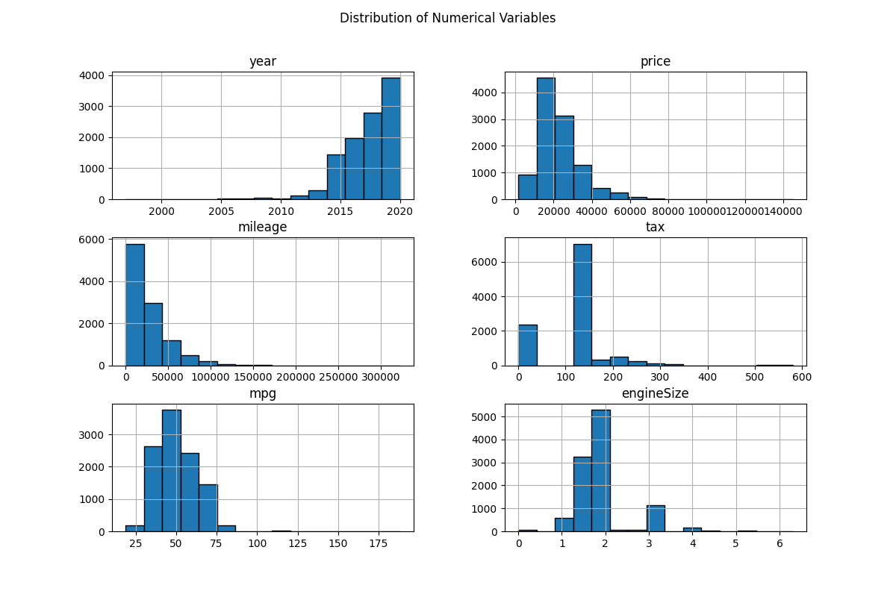

### **2. Car Model Distribution**
- The dataset includes several car models, with some like the `A3` and `Q3` appearing more frequently. These may represent popular or entry-level models.

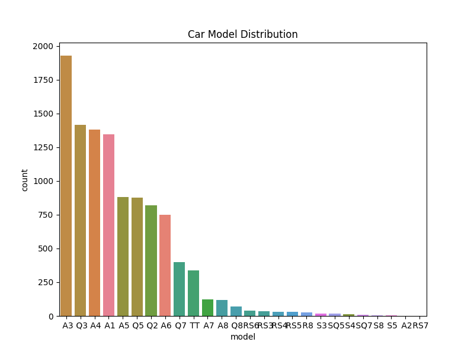

### **3. Transmission Type Distribution**
- Most cars in the dataset have `Manual` or `Semi-Auto` transmission, with `Automatic` being less common. Manual transmission seems to dominate.

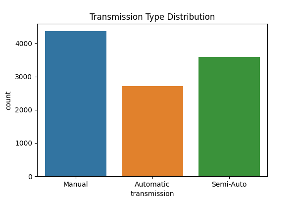

### **4. Fuel Type Distribution**
- The dataset is dominated by `Diesel` and `Petrol` cars. Hybrid cars are present but in much smaller numbers, reflecting a focus on traditional fuel types.

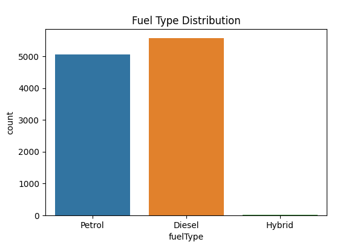

### **5. Correlation Heatmap**
- Strong positive correlation is observed between `engineSize`, `year` and `price` (+0.59). Larger engines generally mean higher car prices also as newer cars tend to cost more.
- Strong negative correlation is observed between `mileage` and `year` (-0.79). Newer cars have less mileage comparing with old cars.

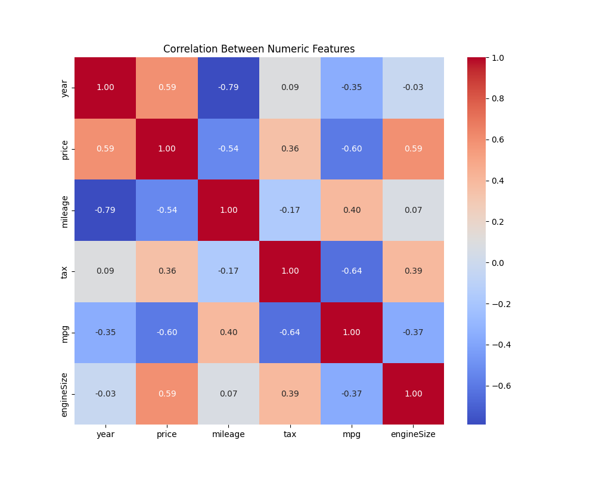

---

## **Hypotheses Analysis**

### **Hypothesis 1:** Price depends on the year of manufacture and engine size.
- **Observation:** Scatter plots confirm this hypothesis. Cars with larger engines and newer manufacturing years are generally more expensive.

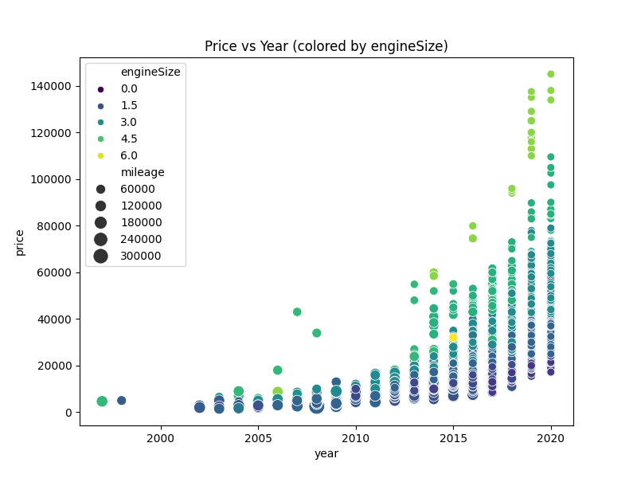

### **Hypothesis 2:** Diesel cars have better fuel efficiency (`mpg`).
- **Observation:** Boxplots indicate that Diesel cars tend to have slightly higher `mpg` compared to Petrol cars. However, some hybrids may exceed Diesel in fuel efficiency.

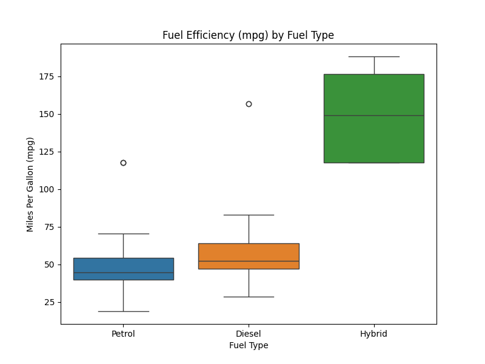

### **Hypothesis 3:** Cars with automatic transmission are more expensive.
- **Observation:** Boxplots show that cars with `Automatic` and `Semi-Auto` transmissions have higher median prices compared to `Manual` cars. This supports the hypothesis.

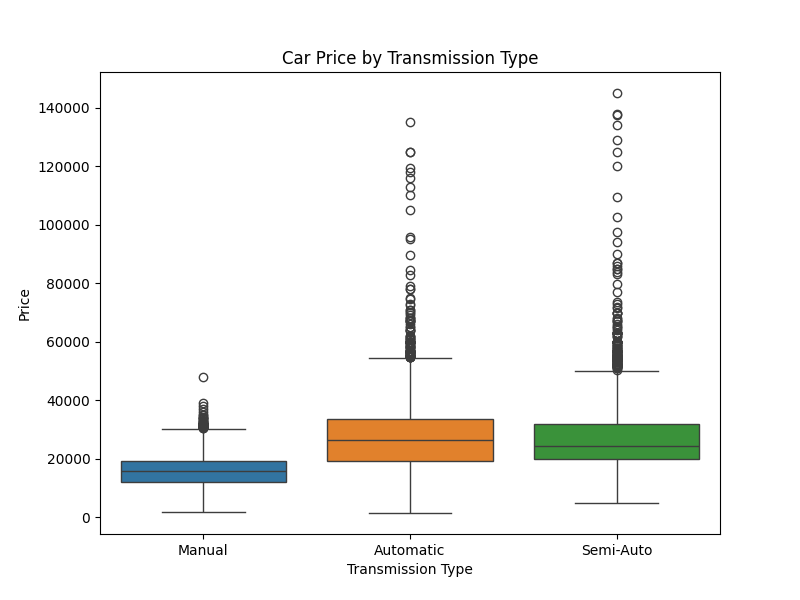

---

## **Conclusions**
1. **Key Factors Influencing Price:** Engine size, year of manufacture, and transmission type are the primary factors driving car prices.
2. **Fuel Efficiency:** Diesel cars are generally more fuel-efficient compared to Petrol cars, aligning with industry standards.
3. **Transmission and Pricing:** Automatic transmissions are associated with higher car prices, likely due to the increased cost of manufacturing and convenience.

---

# Clustering Project
### **Preprocessing Operations**

1. **Numerical Features (`year`, `price`, `mileage`, `tax`, `mpg`, `engineSize`):** 
Standardize using `StandardScaler` to ensure all numerical features have zero mean and unit variance. This helps K-Means avoid biasing the results toward features with larger scales.
2. **Categorical Features (`model`, `transmission`, `fuelType`):** 
Apply `one-hot` encoding to convert these categorical features into numerical format suitable for K-Means.
3. **Dropping Features:** 
No features are dropped as all provide valuable information.

---

### Cluster Analysis for KMeans

After performing the clustering analysis with `k=4`, we observe the following characteristics for each cluster based on the visualizations and data analysis:

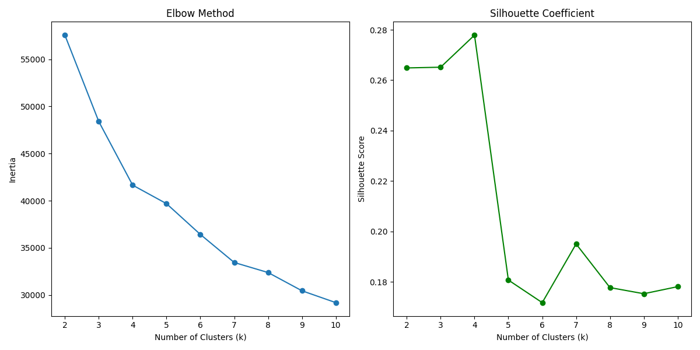

#### Cluster 0:
- **Number of Points**: 990
- **Centroid (Numeric Features)**: 
  - The cars in this cluster tend to have higher prices, larger engine sizes, and moderate mileage. They also have relatively higher tax values.
- **Most Common Categorical Features**: 
  - **Model**: Q7
  - **Transmission**: Semi-Auto
  - **Fuel Type**: Diesel

#### Cluster 1:
- **Number of Points**: 2607
- **Centroid (Numeric Features)**: 
  - This cluster shows lower prices, higher mileage, and better fuel efficiency compared to the other clusters. The tax is lower, indicating more economical vehicles.
- **Most Common Categorical Features**: 
  - **Model**: A3
  - **Transmission**: Manual
  - **Fuel Type**: Diesel

#### Cluster 2:
- **Number of Points**: 5030
- **Centroid (Numeric Features)**: 
  - Cars in this cluster have moderate prices, lower mileage, and smaller engine sizes. The tax values are moderate, with slightly lower fuel efficiency.
- **Most Common Categorical Features**: 
  - **Model**: Q3
  - **Transmission**: Semi-Auto
  - **Fuel Type**: Petrol

#### Cluster 3:
- **Number of Points**: 2041
- **Centroid (Numeric Features)**: 
  - This cluster has lower prices and moderate engine sizes, with higher mileage and moderate tax values. The cars tend to have lower fuel efficiency.
- **Most Common Categorical Features**: 
  - **Model**: Q3
  - **Transmission**: Semi-Auto
  - **Fuel Type**: Diesel
---

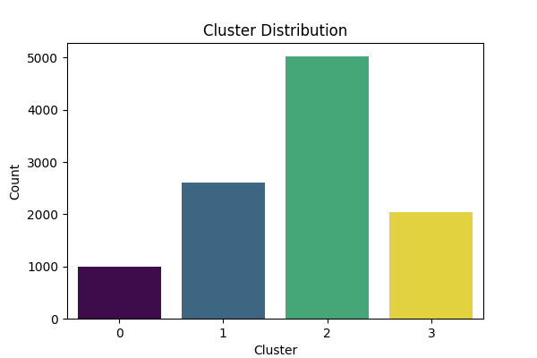

### Cluster Characteristics

#### **Cluster 0:**
- **Number of Points**: 990
- **Centroid (Numeric Features)**: 
  - **Year**: 2018.34 (Newer vehicles)
  - **Price**: 47641.84 (High prices)
  - **Mileage**: 12606.78 (Moderate mileage)
  - **Tax**: 166.75 (Moderate tax)
  - **MPG**: 36.18 (Low fuel efficiency)
  - **Engine Size**: 3.19 (Larger engine sizes)
- **Most Common Categorical Features**:
  - **Model**: Q7 (Luxury SUV)
  - **Transmission**: Semi-Auto
  - **Fuel Type**: Diesel

#### **Cluster 1:**
- **Number of Points**: 2607
- **Centroid (Numeric Features)**:
  - **Year**: 2015.73 (Older vehicles)
  - **Price**: 13619.62 (Lower prices)
  - **Mileage**: 40337.74 (Higher mileage)
  - **Tax**: 31.83 (Lower tax)
  - **MPG**: 66.25 (Better fuel efficiency)
  - **Engine Size**: 1.67 (Smaller engine sizes)
- **Most Common Categorical Features**:
  - **Model**: A3 (Compact car)
  - **Transmission**: Manual
  - **Fuel Type**: Diesel

#### **Cluster 2:**
- **Number of Points**: 5030
- **Centroid (Numeric Features)**:
  - **Year**: 2018.54 (Newer vehicles)
  - **Price**: 25257.79 (Moderate prices)
  - **Mileage**: 9668.39 (Low mileage)
  - **Tax**: 145.99 (Moderate tax)
  - **MPG**: 46.01 (Moderate fuel efficiency)
  - **Engine Size**: 1.72 (Smaller engine sizes)
- **Most Common Categorical Features**:
  - **Model**: Q3 (Compact SUV)
  - **Transmission**: Semi-Auto
  - **Fuel Type**: Petrol

#### **Cluster 3:**
- **Number of Points**: 2041
- **Centroid (Numeric Features)**:
  - **Year**: 2014.70 (Older vehicles)
  - **Price**: 16.924.74 (Moderate prices)
  - **Mileage**: 48250.65 (High mileage)
  - **Tax**: 177.32 (Moderate tax)
  - **MPG**: 49.82 (Low fuel efficiency)
  - **Engine Size**: 2.18 (Medium engine sizes)
- **Most Common Categorical Features**:
  - **Model**: Q3 (Compact SUV)
  - **Transmission**: Semi-Auto
  - **Fuel Type**: Diesel

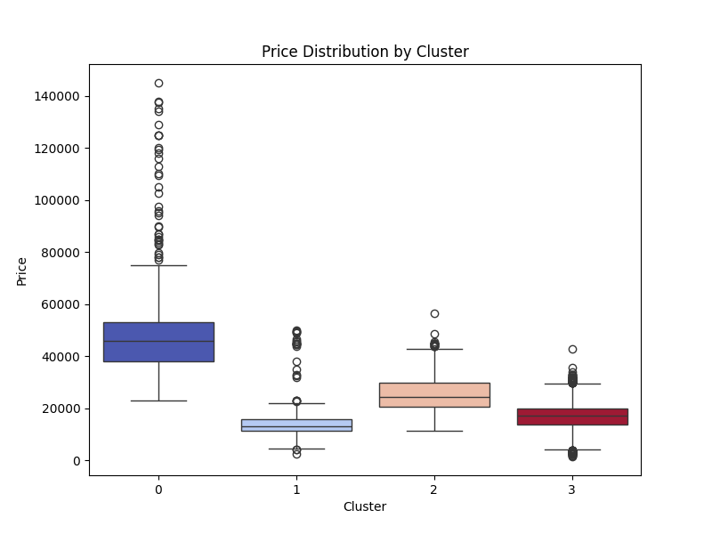
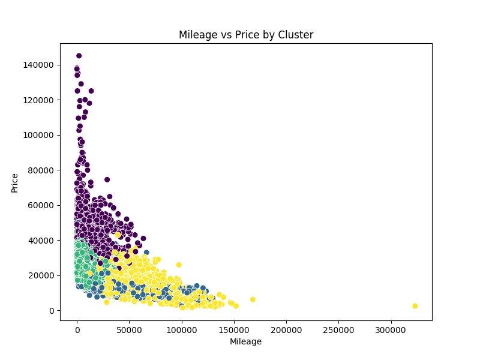
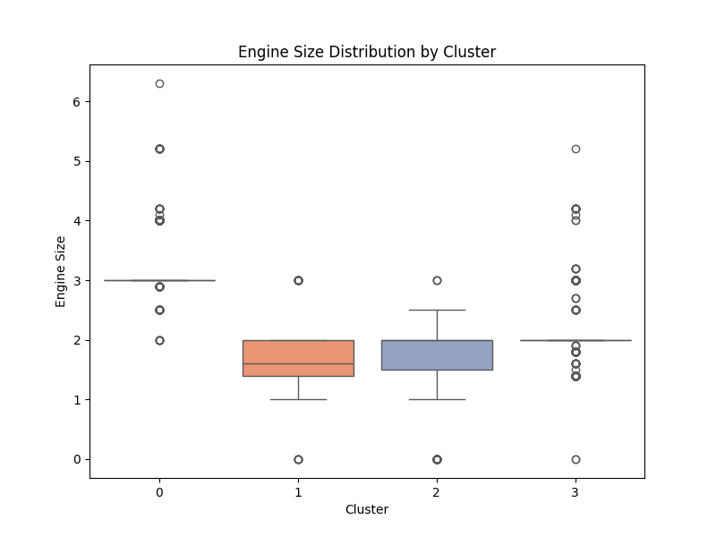

### **Summary of Cluster Characteristics:**

- **Cluster 0** represents high-end vehicles, such as the Q7 model, characterized by larger engines, higher prices, and low fuel efficiency. They are relatively newer vehicles with moderate mileage.
- **Cluster 1** includes vehicles like the A3 model, which are more economical with smaller engines, lower prices, and better fuel efficiency. They tend to have higher mileage and are older vehicles.
- **Cluster 2** contains newer vehicles with moderate prices and lower mileage. These cars generally have smaller engines and moderate fuel efficiency. The most common model in this cluster is the Q3.
- **Cluster 3** is a group of older vehicles with high mileage, moderate prices, and medium engine sizes. These cars are generally less fuel-efficient but still fall into the mid-tier price range, with the Q3 being the most common model.

---

### Cluster Analysis of Agglomerative Clustering

After performing the clustering analysis with `k=4`, we observe the following characteristics for each cluster based on the visualizations and data analysis:

#### Cluster 0:
- **Number of Points**: 3951
- **Centroid (Numeric Features)**: 
  - The cars in this cluster tend to have moderate prices, newer models, and lower mileage. The tax values are higher, and the engine sizes are moderately large.
- **Most Common Categorical Features**: 
  - **Model**: Q3
  - **Transmission**: Manual
  - **Fuel Type**: Diesel

#### Cluster 1:
- **Number of Points**: 3520
- **Centroid (Numeric Features)**: 
  - This cluster shows higher prices, newer vehicles, and lower mileage. The fuel efficiency is moderate, with a relatively lower tax value compared to other clusters.
- **Most Common Categorical Features**: 
  - **Model**: A3
  - **Transmission**: Semi-Auto
  - **Fuel Type**: Petrol

#### Cluster 2:
- **Number of Points**: 2385
- **Centroid (Numeric Features)**: 
  - Cars in this cluster have lower prices, older models, and higher mileage. The engine sizes are moderate, and the fuel efficiency is quite good. The tax values are generally low.
- **Most Common Categorical Features**: 
  - **Model**: A3
  - **Transmission**: Manual
  - **Fuel Type**: Diesel

#### Cluster 3:
- **Number of Points**: 812
- **Centroid (Numeric Features)**: 
  - This cluster contains expensive vehicles with newer models, higher engine sizes, and relatively low mileage. The fuel efficiency is moderate, and tax values are high.
- **Most Common Categorical Features**: 
  - **Model**: Q7
  - **Transmission**: Semi-Auto
  - **Fuel Type**: Diesel

---

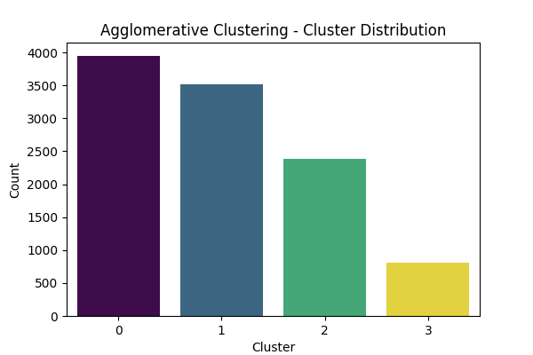

### Cluster Characteristics

#### **Cluster 0:**
- **Number of Points**: 3951
- **Centroid (Numeric Features)**:
  - **Year**: 2015.88 (Newer vehicles)
  - **Price**: 18704.99 (Moderate prices)
  - **Mileage**: 35116.26 (Moderate mileage)
  - **Tax**: 167.54 (Higher tax)
  - **MPG**: 51.52 (Moderate fuel efficiency)
  - **Engine Size**: 1.98 (Moderate engine sizes)
- **Most Common Categorical Features**:
  - **Model**: Q3 (Compact SUV)
  - **Transmission**: Manual
  - **Fuel Type**: Diesel

#### **Cluster 1:**
- **Number of Points**: 3520
- **Centroid (Numeric Features)**:
  - **Year**: 2019.09 (Newest vehicles)
  - **Price**: 27776.38 (Higher prices)
  - **Mileage**: 5628.55 (Low mileage)
  - **Tax**: 145.72 (Moderate tax)
  - **MPG**: 42.94 (Moderate fuel efficiency)
  - **Engine Size**: 1.77 (Moderate engine sizes)
- **Most Common Categorical Features**:
  - **Model**: A3 (Compact car)
  - **Transmission**: Semi-Auto
  - **Fuel Type**: Petrol

#### **Cluster 2:**
- **Number of Points**: 2385
- **Centroid (Numeric Features)**:
  - **Year**: 2015.63 (Older vehicles)
  - **Price**: 13557.95 (Lower prices)
  - **Mileage**: 41251.39 (High mileage)
  - **Tax**: 21.44 (Low tax)
  - **MPG**: 66.23 (Good fuel efficiency)
  - **Engine Size**: 1.68 (Smaller engine sizes)
- **Most Common Categorical Features**:
  - **Model**: A3 (Compact car)
  - **Transmission**: Manual
  - **Fuel Type**: Diesel

#### **Cluster 3:**
- **Number of Points**: 812
- **Centroid (Numeric Features)**:
  - **Year**: 2018.72 (Newer vehicles)
  - **Price**: 49568.78 (High prices)
  - **Mileage**: 9748.30 (Low mileage)
  - **Tax**: 145.68 (Moderate tax)
  - **MPG**: 35.64 (Low fuel efficiency)
  - **Engine Size**: 3.16 (Larger engine sizes)
- **Most Common Categorical Features**:
  - **Model**: Q7 (Luxury SUV)
  - **Transmission**: Semi-Auto
  - **Fuel Type**: Diesel

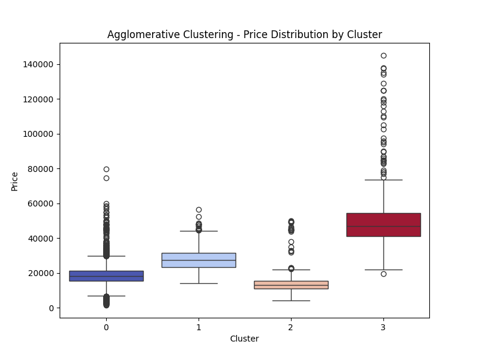
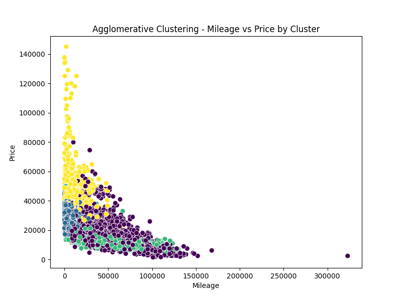
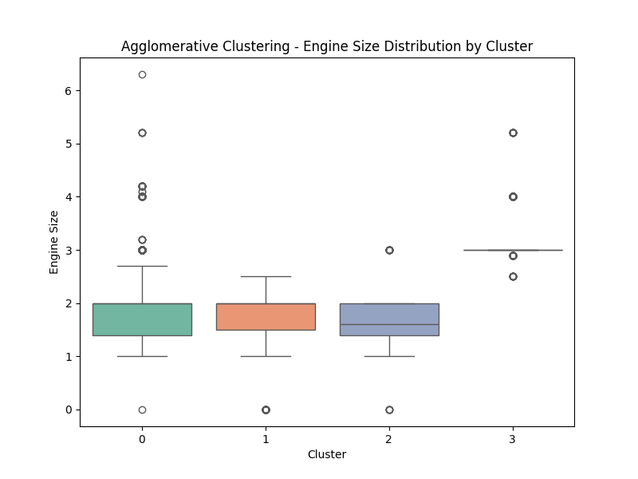

### **Summary of Cluster Characteristics:**

- **Cluster 0** represents vehicles like the Q3 model, which are moderately priced, relatively newer, and tend to have lower mileage. They have moderate engine sizes and tax values, with diesel fuel type being predominant. These cars are generally efficient in terms of fuel consumption.
  
- **Cluster 1** includes models like the A3, characterized by relatively newer vehicles with low mileage and moderate fuel efficiency. These cars have higher prices, smaller engine sizes, and are predominantly petrol-powered. They are more economical and efficient in fuel usage compared to other clusters.

- **Cluster 2** contains vehicles with lower prices and higher mileage. These are older vehicles with moderate engine sizes and lower tax values. Diesel is the most common fuel type in this group, and they tend to have better fuel efficiency than other clusters with a more budget-friendly price range.

- **Cluster 3** represents high-end luxury vehicles like the Q7, which have larger engine sizes, higher prices, and low fuel efficiency. These vehicles are generally newer with lower mileage but are characterized by their larger engines and high tax values, making them less fuel-efficient compared to the other clusters.

---


### Observations:
1. **Cluster Separation**:
   - The clusters are well-separated, primarily by price, mileage, and engine size.
   - Cluster 0 stands out distinctly due to its high prices and powerful engines, while Cluster 1 is characterized by affordability and high mileage.

2. **Insights**:
   - Customers with limited budgets are likely to fall into Cluster 1.
   - Luxury-seekers will find Cluster 0 models appealing, while Clusters 2 and 3 represent balanced choices for the mid-tier market.

## Summary of Insights

### Key Findings:
1. **Price and Engine Size**: The most significant factors influencing the price of a car are its engine size and year of manufacture. Newer cars with larger engines tend to be more expensive, as observed in **Cluster 0**, which consists of luxury models like the Q7.
2. **Mileage and Fuel Efficiency**: There is a strong inverse relationship between mileage and year, with newer cars having lower mileage. Diesel cars are generally more fuel-efficient than Petrol cars, though some hybrids show superior fuel efficiency.
3. **Transmission and Pricing**: Cars with `Automatic` or `Semi-Auto` transmissions have higher median prices compared to `Manual` cars. This suggests that automatic transmissions are often associated with more expensive models due to added convenience and manufacturing costs.

### KMeans vs Agglomerative Clustering
- **KMeans**: This method provided a clearer separation between high-end luxury vehicles (Cluster 0, e.g., Q7) and more affordable, economical cars (Cluster 1, e.g., A3). It grouped cars based on price, engine size, and fuel type, with more compact and older vehicles falling into separate clusters.
- **Agglomerative Clustering**: This method identified similar patterns but with more variation in terms of vehicle models and tax values. It grouped vehicles more by model (e.g., Q3, A3) and their relative fuel efficiency, showing a clearer distinction in terms of both vehicle age and fuel type.

### Conclusion:
The dataset reveals clear segmentation of the Audi car market into distinct clusters based on price, engine size, and other key features. Understanding these clusters allows for better targeting of customer segments based on their preferences for price, performance, and fuel efficiency. The most interesting insight is the relationship between car model features (like engine size and transmission type) and their corresponding market segments, providing valuable information for both marketing and inventory management strategies.